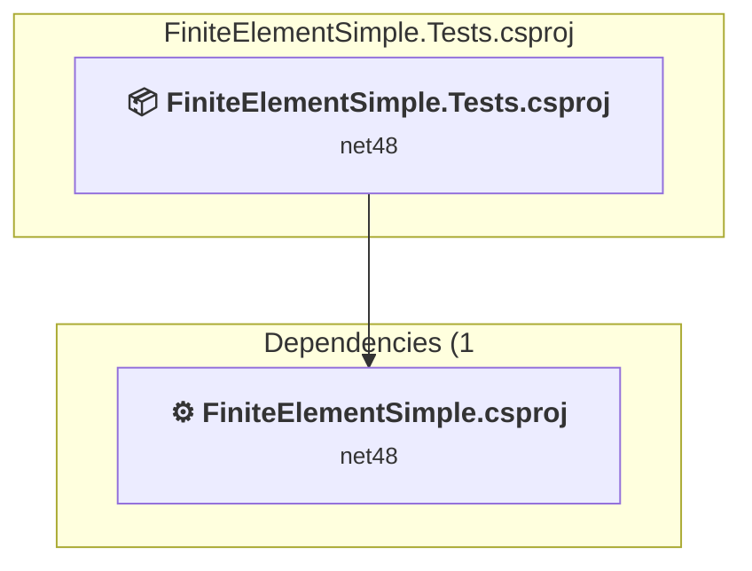
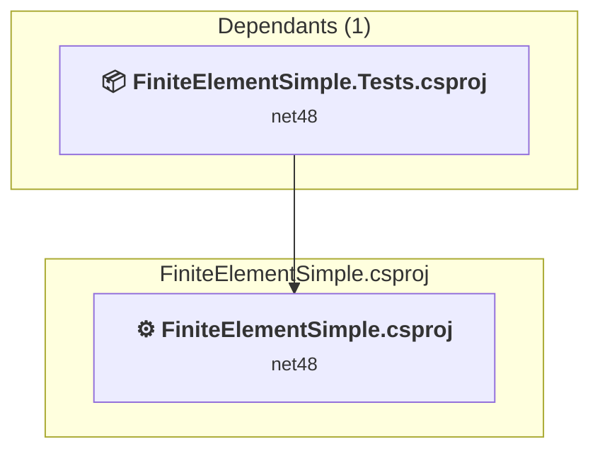

# Projects and dependencies analysis

This document provides a comprehensive overview of the projects and their dependencies in the context of upgrading to .NETCoreApp,Version=v10.0.

## Table of Contents

- [Executive Summary](#executive-Summary)
  - [Highlevel Metrics](#highlevel-metrics)
  - [Projects Compatibility](#projects-compatibility)
  - [Package Compatibility](#package-compatibility)
  - [API Compatibility](#api-compatibility)
  - [Binding Redirect Configuration](#binding-redirect-configuration)
- [Aggregate NuGet packages details](#aggregate-nuget-packages-details)
- [Top API Migration Challenges](#top-api-migration-challenges)
  - [Technologies and Features](#technologies-and-features)
  - [Most Frequent API Issues](#most-frequent-api-issues)
- [Projects Relationship Graph](#projects-relationship-graph)
- [Project Details](#project-details)

  - [FiniteElementSimple.Tests\FiniteElementSimple.Tests.csproj](#finiteelementsimpletestsfiniteelementsimpletestscsproj)
  - [FiniteElementSimple\FiniteElementSimple.csproj](#finiteelementsimplefiniteelementsimplecsproj)

## Executive Summary

### Highlevel Metrics

| Metric | Count | Status |
| :--- | :---: | :--- |
| Total Projects | 2 | All require upgrade |
| Total NuGet Packages | 26 | 5 need upgrade |
| Total Code Files | 24 |  |
| Total Code Files with Incidents | 6 |  |
| Total Lines of Code | 2398 |  |
| Total Number of Issues | 48 |  |
| Estimated LOC to modify | 22+ | at least 0.9% of codebase |

### Projects Compatibility

| Project | Target Framework | Difficulty | Package Issues | API Issues | Binding Issues | Est. LOC Impact | Description |
| :--- | :---: | :---: | :---: | :---: | :---: | :---: | :--- |
| [FiniteElementSimple.Tests\FiniteElementSimple.Tests.csproj](#finiteelementsimpletestsfiniteelementsimpletestscsproj) | net48 | 🟢 Low | 0 | 0 | 0 |  | ClassLibrary, Sdk Style = True |
| [FiniteElementSimple\FiniteElementSimple.csproj](#finiteelementsimplefiniteelementsimplecsproj) | net48 | 🟢 Low | 9 | 22 | 14 | 22+ | ClassicWinForms, Sdk Style = False |

### Package Compatibility

| Status | Count | Percentage |
| :--- | :---: | :---: |
| ✅ Compatible | 21 | 80.8% |
| ⚠️ Incompatible | 4 | 15.4% |
| 🔄 Upgrade Recommended | 1 | 3.8% |
| ***Total NuGet Packages*** | ***26*** | ***100%*** |

### API Compatibility

| Category | Count | Impact |
| :--- | :---: | :--- |
| 🔴 Binary Incompatible | 22 | High - Require code changes |
| 🟡 Source Incompatible | 0 | Medium - Needs re-compilation and potential conflicting API error fixing |
| 🔵 Behavioral change | 0 | Low - Behavioral changes that may require testing at runtime |
| ✅ Compatible | 1669 |  |
| ***Total APIs Analyzed*** | ***1691*** |  |

### Binding Redirect Configuration

| Severity | Count | Description |
| :--- | :---: | :--- |
| 🟡Potential | 14 | May cause issues in certain scenarios |
| ***Total Binding Issues*** | ***14*** | ***Across 1 project(s)*** |

## Aggregate NuGet packages details

| Package | Current Version | Suggested Version | Projects | Description |
| :--- | :---: | :---: | :--- | :--- |
| HarfBuzzSharp | 8.3.1.1 |  | [FiniteElementSimple.csproj](#finiteelementsimplefiniteelementsimplecsproj) | ✅Compatible |
| HarfBuzzSharp.NativeAssets.Linux | 8.3.1.1 |  | [FiniteElementSimple.csproj](#finiteelementsimplefiniteelementsimplecsproj) | ✅Compatible |
| HarfBuzzSharp.NativeAssets.macOS | 8.3.1.1 |  | [FiniteElementSimple.csproj](#finiteelementsimplefiniteelementsimplecsproj) | ✅Compatible |
| HarfBuzzSharp.NativeAssets.Win32 | 8.3.1.1 |  | [FiniteElementSimple.csproj](#finiteelementsimplefiniteelementsimplecsproj) | ✅Compatible |
| MathNet.Numerics | 5.0.0 |  | [FiniteElementSimple.csproj](#finiteelementsimplefiniteelementsimplecsproj) | ✅Compatible |
| Microsoft.NET.Test.Sdk | 17.11.1 |  | [FiniteElementSimple.Tests.csproj](#finiteelementsimpletestsfiniteelementsimpletestscsproj) | ✅Compatible |
| NUnit | 4.6.1 |  | [FiniteElementSimple.Tests.csproj](#finiteelementsimpletestsfiniteelementsimpletestscsproj) | ✅Compatible |
| NUnit.Analyzers | 4.4.0 |  | [FiniteElementSimple.Tests.csproj](#finiteelementsimpletestsfiniteelementsimpletestscsproj) | ✅Compatible |
| NUnit3TestAdapter | 4.6.0 |  | [FiniteElementSimple.Tests.csproj](#finiteelementsimpletestsfiniteelementsimpletestscsproj) | ✅Compatible |
| OpenTK | 3.1.0 | 4.9.4 | [FiniteElementSimple.csproj](#finiteelementsimplefiniteelementsimplecsproj) | ⚠️NuGet package is incompatible |
| OpenTK.GLControl | 3.1.0 | 4.0.2 | [FiniteElementSimple.csproj](#finiteelementsimplefiniteelementsimplecsproj) | ⚠️NuGet package is incompatible |
| ScottPlot | 5.1.59 |  | [FiniteElementSimple.csproj](#finiteelementsimplefiniteelementsimplecsproj) | ✅Compatible |
| ScottPlot.WinForms | 5.1.59 | 4.1.73 | [FiniteElementSimple.csproj](#finiteelementsimplefiniteelementsimplecsproj) | ⚠️NuGet package is incompatible |
| SkiaSharp | 3.119.0 |  | [FiniteElementSimple.csproj](#finiteelementsimplefiniteelementsimplecsproj) | ✅Compatible |
| SkiaSharp.HarfBuzz | 3.119.0 |  | [FiniteElementSimple.csproj](#finiteelementsimplefiniteelementsimplecsproj) | ✅Compatible |
| SkiaSharp.NativeAssets.Linux.NoDependencies | 3.119.0 |  | [FiniteElementSimple.csproj](#finiteelementsimplefiniteelementsimplecsproj) | ✅Compatible |
| SkiaSharp.NativeAssets.macOS | 3.119.0 |  | [FiniteElementSimple.csproj](#finiteelementsimplefiniteelementsimplecsproj) | ✅Compatible |
| SkiaSharp.NativeAssets.Win32 | 3.119.0 |  | [FiniteElementSimple.csproj](#finiteelementsimplefiniteelementsimplecsproj) | ✅Compatible |
| SkiaSharp.Views.Desktop.Common | 3.119.0 |  | [FiniteElementSimple.csproj](#finiteelementsimplefiniteelementsimplecsproj) | ✅Compatible |
| SkiaSharp.Views.WindowsForms | 3.119.0 | 2.88.9 | [FiniteElementSimple.csproj](#finiteelementsimplefiniteelementsimplecsproj) | ⚠️NuGet package is incompatible |
| StapletonMathPackage | 1.3.4 |  | [FiniteElementSimple.csproj](#finiteelementsimplefiniteelementsimplecsproj) [FiniteElementSimple.Tests.csproj](#finiteelementsimpletestsfiniteelementsimpletestscsproj) | ✅Compatible |
| System.Buffers | 4.5.1 |  | [FiniteElementSimple.csproj](#finiteelementsimplefiniteelementsimplecsproj) | NuGet package functionality is included with framework reference |
| System.Memory | 4.5.5 |  | [FiniteElementSimple.csproj](#finiteelementsimplefiniteelementsimplecsproj) | NuGet package functionality is included with framework reference |
| System.Numerics.Vectors | 4.5.0 |  | [FiniteElementSimple.csproj](#finiteelementsimplefiniteelementsimplecsproj) | NuGet package functionality is included with framework reference |
| System.Runtime.CompilerServices.Unsafe | 4.5.3 | 6.1.2 | [FiniteElementSimple.csproj](#finiteelementsimplefiniteelementsimplecsproj) | NuGet package upgrade is recommended |
| System.ValueTuple | 4.6.1 |  | [FiniteElementSimple.csproj](#finiteelementsimplefiniteelementsimplecsproj) | NuGet package functionality is included with framework reference |

## Top API Migration Challenges

### Technologies and Features

| Technology | Issues | Percentage | Migration Path |
| :--- | :---: | :---: | :--- |
| Windows Forms | 22 | 100.0% | Windows Forms APIs for building Windows desktop applications with traditional Forms-based UI that are available in .NET on Windows. Enable Windows Desktop support: Option 1 (Recommended): Target net9.0-windows; Option 2: Add <UseWindowsDesktop>true</UseWindowsDesktop>; Option 3 (Legacy): Use Microsoft.NET.Sdk.WindowsDesktop SDK. |

### Most Frequent API Issues

| API | Count | Percentage | Category |
| :--- | :---: | :---: | :--- |
| M:System.Windows.Forms.Form.#ctor | 4 | 18.2% | Binary Incompatible |
| T:System.Windows.Forms.DockStyle | 3 | 13.6% | Binary Incompatible |
| T:System.Windows.Forms.DialogResult | 2 | 9.1% | Binary Incompatible |
| M:System.Windows.Forms.Form.ShowDialog | 2 | 9.1% | Binary Incompatible |
| M:System.Windows.Forms.Form.Activate | 2 | 9.1% | Binary Incompatible |
| T:System.Windows.Forms.Control.ControlCollection | 1 | 4.5% | Binary Incompatible |
| P:System.Windows.Forms.Control.Controls | 1 | 4.5% | Binary Incompatible |
| M:System.Windows.Forms.Control.ControlCollection.Add(System.Windows.Forms.Control) | 1 | 4.5% | Binary Incompatible |
| F:System.Windows.Forms.DockStyle.Fill | 1 | 4.5% | Binary Incompatible |
| P:System.Windows.Forms.Control.Dock | 1 | 4.5% | Binary Incompatible |
| P:System.Windows.Forms.Control.Height | 1 | 4.5% | Binary Incompatible |
| P:System.Windows.Forms.Control.Width | 1 | 4.5% | Binary Incompatible |
| P:System.Windows.Forms.Form.Text | 1 | 4.5% | Binary Incompatible |
| T:System.Windows.Forms.Form | 1 | 4.5% | Binary Incompatible |

## Projects Relationship Graph

Legend:
📦 SDK-style project
⚙️ Classic project

## Project Details

### FiniteElementSimple.Tests\FiniteElementSimple.Tests.csproj

#### Project Info

- **Current Target Framework:** net48
- **Proposed Target Framework:** net10.0
- **SDK-style**: True
- **Project Kind:** ClassLibrary
- **Dependencies**: 1
- **Dependants**: 0
- **Number of Files**: 3
- **Number of Files with Incidents**: 1
- **Lines of Code**: 357
- **Estimated LOC to modify**: 0+ (at least 0.0% of the project)

#### Dependency Graph

Legend:
📦 SDK-style project
⚙️ Classic project

### API Compatibility

| Category | Count | Impact |
| :--- | :---: | :--- |
| 🔴 Binary Incompatible | 0 | High - Require code changes |
| 🟡 Source Incompatible | 0 | Medium - Needs re-compilation and potential conflicting API error fixing |
| 🔵 Behavioral change | 0 | Low - Behavioral changes that may require testing at runtime |
| ✅ Compatible | 302 |  |
| ***Total APIs Analyzed*** | ***302*** |  |

### FiniteElementSimple\FiniteElementSimple.csproj

#### Project Info

- **Current Target Framework:** net48
- **Proposed Target Framework:** net10.0-windows
- **SDK-style**: False
- **Project Kind:** ClassicWinForms
- **Dependencies**: 0
- **Dependants**: 1
- **Number of Files**: 33
- **Number of Files with Incidents**: 5
- **Lines of Code**: 2041
- **Estimated LOC to modify**: 22+ (at least 1.1% of the project)

#### Dependency Graph

Legend:
📦 SDK-style project
⚙️ Classic project

### API Compatibility

| Category | Count | Impact |
| :--- | :---: | :--- |
| 🔴 Binary Incompatible | 22 | High - Require code changes |
| 🟡 Source Incompatible | 0 | Medium - Needs re-compilation and potential conflicting API error fixing |
| 🔵 Behavioral change | 0 | Low - Behavioral changes that may require testing at runtime |
| ✅ Compatible | 1367 |  |
| ***Total APIs Analyzed*** | ***1389*** |  |

#### Binding Redirect Configuration

| Rule | Severity | Details | Recommendation |
| :--- | :---: | :--- | :--- |
| Missing binding redirect for referenced assembly | 🟡Potential | Manual redirects exist but none covers MathNet.Numerics (referenced v5.0.0.0, package v5.0.0) | Add a binding redirect for the missing assembly. |
| Missing binding redirect for referenced assembly | 🟡Potential | Manual redirects exist but none covers OpenTK (referenced v3.1.0.0, package v3.1.0) | Add a binding redirect for the missing assembly. |
| Missing binding redirect for referenced assembly | 🟡Potential | Manual redirects exist but none covers OpenTK.GLControl (referenced v3.1.0.0, package v3.1.0) | Add a binding redirect for the missing assembly. |
| Missing binding redirect for referenced assembly | 🟡Potential | Manual redirects exist but none covers System.Buffers (referenced v4.0.3.0, package v4.5.1) | Add a binding redirect for the missing assembly. |
| Missing binding redirect for referenced assembly | 🟡Potential | Manual redirects exist but none covers System.Numerics.Vectors (referenced v4.1.4.0, package v4.5.0) | Add a binding redirect for the missing assembly. |
| Missing binding redirect for referenced assembly | 🟡Potential | Manual redirects exist but none covers System.Runtime.CompilerServices.Unsafe (referenced v4.0.4.1, package v4.5.3) | Add a binding redirect for the missing assembly. |
| Missing binding redirect for referenced assembly | 🟡Potential | Manual redirects exist but none covers System.Memory (referenced v4.0.1.2, package v4.5.5) | Add a binding redirect for the missing assembly. |
| Missing binding redirect for referenced assembly | 🟡Potential | Manual redirects exist but none covers HarfBuzzSharp (referenced v1.0.0.0, package v8.3.1.1) | Add a binding redirect for the missing assembly. |
| Missing binding redirect for referenced assembly | 🟡Potential | Manual redirects exist but none covers SkiaSharp (referenced v3.119.0.0, package v3.119.0) | Add a binding redirect for the missing assembly. |
| Missing binding redirect for referenced assembly | 🟡Potential | Manual redirects exist but none covers SkiaSharp.HarfBuzz (referenced v3.119.0.0, package v3.119.0) | Add a binding redirect for the missing assembly. |
| Missing binding redirect for referenced assembly | 🟡Potential | Manual redirects exist but none covers SkiaSharp.Views.Desktop.Common (referenced v3.119.0.0, package v3.119.0) | Add a binding redirect for the missing assembly. |
| Missing binding redirect for referenced assembly | 🟡Potential | Manual redirects exist but none covers SkiaSharp.Views.WindowsForms (referenced v3.119.0.0, package v3.119.0) | Add a binding redirect for the missing assembly. |
| Missing binding redirect for referenced assembly | 🟡Potential | Manual redirects exist but none covers ScottPlot (referenced v5.1.59.0, package v5.1.59) | Add a binding redirect for the missing assembly. |
| Missing binding redirect for referenced assembly | 🟡Potential | Manual redirects exist but none covers ScottPlot.WinForms (referenced v5.1.59.0, package v5.1.59) | Add a binding redirect for the missing assembly. |

#### Project Technologies and Features

| Technology | Issues | Percentage | Migration Path |
| :--- | :---: | :---: | :--- |
| Windows Forms | 22 | 100.0% | Windows Forms APIs for building Windows desktop applications with traditional Forms-based UI that are available in .NET on Windows. Enable Windows Desktop support: Option 1 (Recommended): Target net9.0-windows; Option 2: Add <UseWindowsDesktop>true</UseWindowsDesktop>; Option 3 (Legacy): Use Microsoft.NET.Sdk.WindowsDesktop SDK. |

